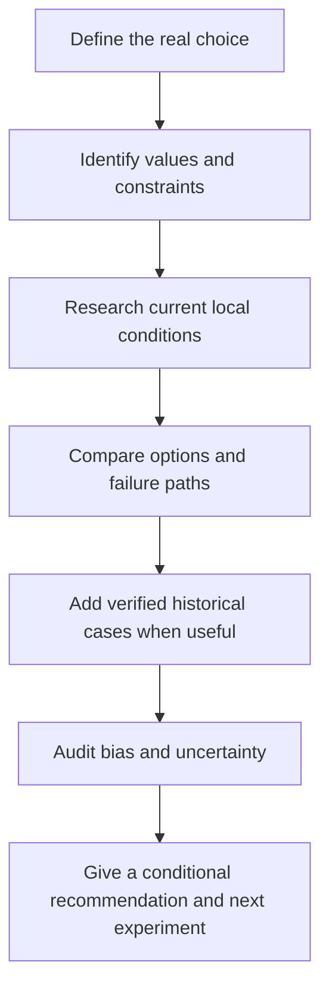

# Evaluate Life Decisions

An open source agent skill for making consequential life and career decisions with current evidence, carefully bounded historical analogies, and decision science.

The skill is designed for questions such as:

- Should I pursue a PhD or stay in industry?
- Should I change careers because of AI?
- Which city or country fits my constraints?
- Should I accept an offer, wait, or run a smaller experiment first?
- When should I persist, pause, or exit a long term plan?

It responds in the user's language and adapts its research to the user's country or region. Historical cases may come from any culture. They are used only when the decision mechanism is genuinely similar and the underlying facts can be verified.

## Design principles

1. **Present conditions first.** Time sensitive claims are checked against current primary sources.
2. **Values stay with the user.** The skill can compare tradeoffs, but it does not choose a life goal for someone.
3. **History is evidence with limits.** It separates facts, interpretation, and analogy.
4. **Uncertainty stays visible.** It avoids invented probabilities and false precision.
5. **Advice must be testable.** Every substantial analysis ends with a low cost next step, a review date, and signals that would change the recommendation.

## How it works



## Repository layout

```text
skills/evaluate-life-decisions/
├── SKILL.md
├── agents/openai.yaml
└── references/
    ├── decision-method.md
    ├── evidence-standard.md
    ├── regional-sources.md
    ├── region-china.md
    └── region-template.md
evals/
├── cases.json
└── rubric.md
scripts/
└── validate.py
```

## Install

Copy `skills/evaluate-life-decisions` into the personal skills directory used by your agent environment. Keep the folder name `evaluate-life-decisions`.

Then invoke it explicitly:

```text
Use $evaluate-life-decisions to help me decide whether to pursue a PhD or stay in industry.
```

The skill can also be selected automatically when the host supports implicit skill invocation.

## Contribute a regional module

Use [`region-template.md`](skills/evaluate-life-decisions/references/region-template.md) to add reliable official statistics, labor market, education, technology, and historical research sources for a country or region. A regional module should improve source discovery without encoding a cultural stereotype or a predetermined answer.

See [CONTRIBUTING.md](CONTRIBUTING.md) for the review checklist.

## Validate

```bash
python3 scripts/validate.py
```

The validator checks the skill metadata, required files, local Markdown links, evaluation cases, and accidental year specific instructions.

## Scope

This project contains original instructions, source maps, and evaluation prompts. It does not bundle copyrighted books or claim that listed books have been ingested. Specific claims from a book must be checked against a lawful, accessible edition before they are cited.

## License

[MIT](LICENSE)
